```mermaid
sequenceDiagram
    participant Mic as Microphone/Jitsi<br/>(48kHz)
    participant Ctx as AudioContext<br/>(16kHz)
    participant SP as ScriptProcessor<br/>(Frontend)
    participant WS_C as WebSocket<br/>(Frontend)
    participant WS_S as WebSocket<br/>(Backend)
    participant Session as StandupVoiceSession
    participant EL_H as ElevenLabsHandler
    participant EL_API as 🤖 ElevenLabs API

    Note over Mic,EL_API: 📤 USER SPEAKING

    Mic->>Ctx: MediaStreamTrack (48kHz)
    Ctx->>SP: Resampled Float32 (16kHz)
    SP->>SP: Buffer (4096 samples)
    SP->>SP: Float32 → PCM16 (Int16)
    SP->>WS_C: Send Binary (PCM16)
    
    WS_C->>WS_S: Binary Message
    WS_S->>Session: process_audio(bytes)
    
    Session->>Session: _is_speech(bytes) (VAD)
    
    alt Speech Detected / Conversation Active
        Session->>EL_H: queue_pcm(bytes)
        EL_H->>EL_H: Buffer += bytes
        
        opt Buffer >= 3200 bytes OR Time > 0.1s
            EL_H->>EL_H: Flush Buffer
            EL_H->>EL_API: WebSocket JSON: {"user_audio_chunk": "base64..."}
        end
    end
```

```mermaid
sequenceDiagram
    participant EL_API as 🤖 ElevenLabs API
    participant EL_H as ElevenLabsHandler
    participant Session as StandupVoiceSession
    participant WS_S as WebSocket<br/>(Backend)
    participant WS_C as WebSocket<br/>(Frontend)
    participant AuthPlay as AudioPlaybackParams
    participant Jitsi as Jitsi/Speakers

    Note over EL_API,Jitsi: 📥 AGENT SPEAKING

    EL_API->>EL_H: JSON Event {"audio_event": {"audio_base64": "..."}}
    EL_H->>EL_H: Base64 Decode
    EL_H->>Session: Callback: _on_audio_response(pcm_bytes)
    Session->>WS_S: send_bytes(pcm_bytes)
    
    WS_S->>WS_C: Binary Message (Blob)
    WS_C->>AuthPlay: injectAudioBlob(blob)
    
    AuthPlay->>AuthPlay: Blob → ArrayBuffer → Int16Array
    AuthPlay->>AuthPlay: Upsample 16k → 48k (3x)
    AuthPlay->>AuthPlay: Create AudioBuffer
    AuthPlay->>Jitsi: Play via MediaStreamAudioDestination
```

# Current Audio Flow Architecture

Complete visualization of real-time audio processing: **Jitsi/Mic ↔ Frontend ↔ Backend ↔ ElevenLabs**

---

## System Architecture Overview


---

## 🎤 Path 1: User Audio Flow (Client → ElevenLabs)

### Complete Flow Diagram



### Detailed Processing Steps

#### 1. Audio Capture (Frontend)
**Files:** `StandupMeetingPage.tsx`, `jitsiService.ts`
- **Source:** `navigator.mediaDevices.getUserMedia` (Mic) OR Jitsi Remote Track.
    - *Note:* Jitsi tracks are natively **48kHz** (Opus standard).
- **Context:** `AudioContext` is explicitly configured with `sampleRate: 16000`.
    - **Optimization:** The browser automatically handles the downsampling from 48kHz (Source) to 16kHz (Context) when `createMediaStreamSource` is called.
- **Processing:** `createScriptProcessor(4096, 1, 1)`.
- **Conversion:** `floatToPcm16` converts Float32Array to Int16Array.

```typescript
// input: Float32Array
const s = Math.max(-1, Math.min(1, float32[i]));
view.setInt16(i * 2, s < 0 ? s * 0x8000 : s * 0x7FFF, true);
// output: ArrayBuffer (PCM16)
```

#### 2. Transport to Backend
- **Protocol:** WebSocket
- **Format:** Raw Binary (PCM16)
- **Endpoint:** `/standup/{standup_id}/voice`

#### 3. Backend Handling
**File:** `voice_endpoint.py`
- **Entry:** `handle_voice_websocket` receives message.
- **Session:** `StandupVoiceSession.process_audio(audio_data)`.
- **VAD:** `_is_speech` calculates RMS energy. Threshold: `0.002`.

#### 4. ElevenLabs Integration
**File:** `elevenlabs_service.py`
- **Class:** `ElevenLabsVoiceHandler`
- **Buffering:** `_pcm_buffer` accumulates PCM bytes.
- **Flush:** Triggers when buffer size >= 3200 bytes (~100ms) or 0.1s elapsed.
- **Payload:** Sends JSON with base64 encoded audio to ElevenLabs WebSocket.

---

## 🔊 Path 2: Agent Audio Flow (ElevenLabs → Client)

### Complete Flow Diagram



### Detailed Processing Steps

#### 1. Reception from ElevenLabs
**File:** `elevenlabs_service.py`
- **Event:** Receives JSON with `audio_event` or `audio` containing base64 string.
- **Decoding:** Base64 decoded to raw PCM16 bytes.
- **Callback:** Notifies registered listeners via `_notify`.

#### 2. Backend Forwarding
**File:** `voice_endpoint.py`
- **Method:** `_on_audio_response`
- **Action:** Sends raw bytes to client WebSocket.

#### 3. Frontend Ingestion
**File:** `StandupMeetingPage.tsx`
- **Action:** `wsRef.current.onmessage` receives `Blob`.
- **Handoff:** Calls `injectAudioIntoJitsi(blob)` -> `audioPlaybackService.injectAudioBlob`.

#### 4. Playback and Upsampling
**File:** `audioPlaybackService.ts`
- **Input:** 16kHz PCM16 Blob.
- **Upsampling:** Simple 3x duplication to match 48kHz Target Rate.
  ```typescript
  // 16k -> 48k
  const v = pcm16[i] / 32768;
  upsampled[i * 3] = v;
  upsampled[i * 3 + 1] = v;
  upsampled[i * 3 + 2] = v;
  ```
- **Output:** `AudioBuffer` played via `AudioBufferSourceNode`.
- **Destination:** Connected to `MediaStreamAudioDestinationNode` for Jitsi injection AND local destination (speakers) for monitoring/playback.

---

## 🎯 Audio Format Summary

| Stage | Format | Sample Rate |
|-------|--------|-------------|
| **Jitsi/Mic Source** | Opus / Native | 48 kHz |
| **Client Processing** | Float32 | 16 kHz (Downsampled) |
| **Client Send** | PCM16 (Int16) | 16 kHz |
| **Backend Recv** | PCM16 Bytes | 16 kHz |
| **ElevenLabs Send** | Base64 PCM16 | 16 kHz |
| **ElevenLabs Recv** | Base64 PCM16 | 16 kHz |
| **Backend Send** | PCM16 Bytes | 16 kHz |
| **Client Playback** | Float32 (Upsampled) | 48 kHz |

## 🔍 Key Observations & Optimizations

1.  **Implicit Downsampling**: While Jitsi tracks are 48kHz, we initialize the `AudioContext` with `sampleRate: 16000` (`jitsiService.ts`), forcing the browser to downsample the stream before we process it. This saves bandwidth but relies on browser resampling quality.
2.  **ScriptProcessorNode Usage**: The frontend uses the older `ScriptProcessorNode` API instead of `AudioWorklet`. This works but runs on the main thread.
3.  **Simple VAD**: The backend implements a lightweight, energy-based VAD (`_is_speech`) to detect speech before sending to ElevenLabs, likely to save costs or avoid triggering on silence.
4.  **16kHz Standardization**: The entire pipeline (Capture -> Backend -> AI) is standardized on 16kHz, with upsampling only happening at the very end for 48kHz playback compatibility.
5.  **Buffering**: Explicit buffering (3200 bytes) in `ElevenLabsVoiceHandler` helps ensure efficiently sized chunks are sent to the API.
